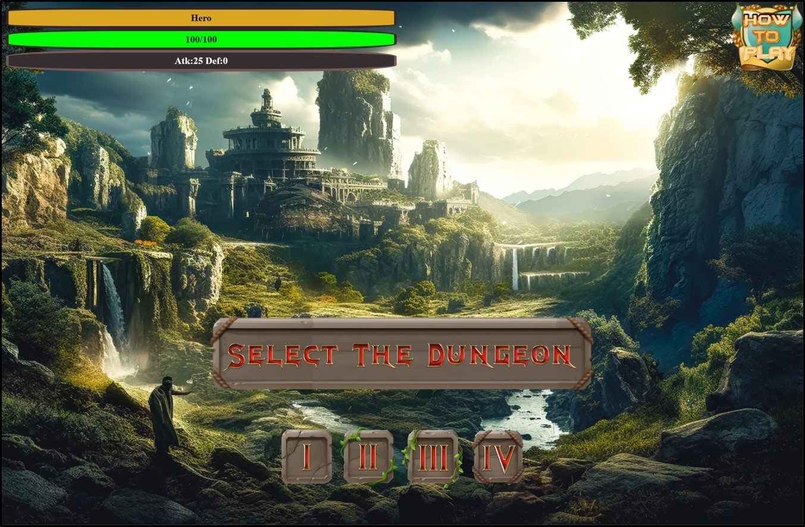
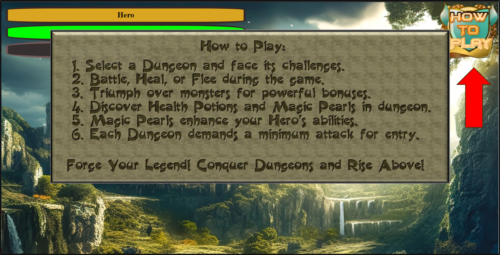
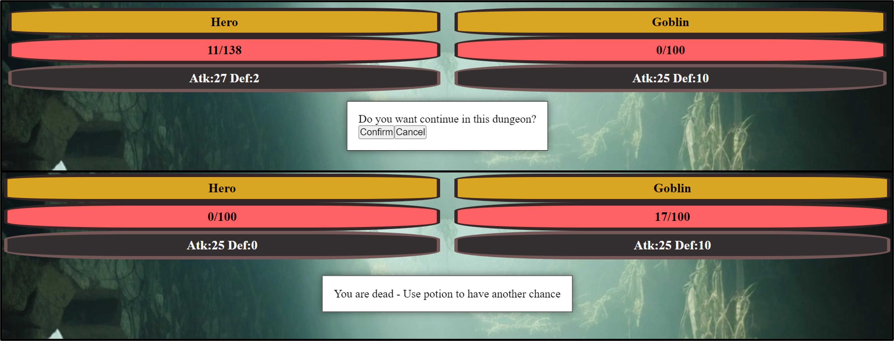

# ADVENTURER'S GUILD THE GAME

Embark on an epic adventure in Adventurer's Guild The game, a thrilling role-playing game that challenges you to become a legendary hero. Immerse yourself in a fantasy world filled with dungeons, monsters, and magic as you strive to overcome formidable foes and prove your mettle.

[Adventurer's Guild Web Site](https://volneirj.github.io/adventurers-guild/)

## Project Overview

### Purpose:

As part of a course project, this website serves as an educational resource, demonstrating the application of web development skills to create an engaging online platform. Through the mini game presented, we aim to explore HTML/CSS/JavaScript features, creating an accessible and responsive design.

### Existing Features

#### LOGO

- The logo image contains a square style, and it has been generated using the free web site [CoolText Graphics Generator](https://cooltext.com/).

#### Game Container

- The game container is where the user will interact and play the game.
- The background brings the idea of a medieval and fantasy world.
- The main screen have the hero life and status, how to play and the dungeon selection.

#### Life bar and status

- The life bar and the status bar is where the user keep tracking of his progress in the game.

#### How to play

- The button on the top right of the game container open an alert to show the user basic how to play the game
- The button is Responsive changing the size for diferent screens.

#### Dungeon Selection

- On the dungeon selection you will be able to select the what game do you want to play.
- Every dungeon has his own power attack requirement.
- When you have some restricion to access specific dungeon a pop up will explain why.

#### Dungeon Dynamic and Interface

- The dungeon have a friendly and easy user interface.
- Life bar and status from the Hero and Monster.
- The background image is unique for each dungeon.
- The monster is unique for each dungeon.
- To the user interact he has three options Attack, Use Health Potion or Run.

#### Life bar, status and monster name.

- On the top of the game container you have the Hero/Monster name, Life bar and Status Bar. 
- The life bar interacts with the amount of life the player and the monster have, if the life is bigger than 50% it turn green, if less than 50% it turn yellow if less than 25% it turn red.
- The hero status will be increase after he win the battle and will show it on the status bar.

#### The footer section

- Contains clickable links to Facebook, Instagram, and Whatsapp for contact.

## Design

### Main Screen Pre Design

### About us Pre Design

## Technologies

- **HTML:** The structure of the website.
- **CSS:** Styling using custom CSS.
- **JavaScript:** Backend Development
- **CodeAnywhere.com:** Online IDE.
- **Visual Studio Code:** Local IDE.
- **GitHub:** Source code hosting and deployment.
- **Git:** Version control.
- **Font Awesome:** Icons for social media links.
- **Iloveimg.com:** Image size reduction.
- **Cloudconvert:** Image format conversion.
- **Favicon.io:** Favicon creation.
- **Canvas:** Wireframes/Pre-design/
- **Leonardo.ai:** AI Image Generator

## Testing and Fixing Bugs

### User Interaction Feedback

- The website has been tested the response changing the sizes and using navigation bar on follow browsers: Chrome, Microsoft Edge,Opera, Firefox.
- For mobile test, it has been tested using Google Chrome Devtools, also tested on my personal mobile Xiami 11 pro. 
- Responsive design on standard screen sizes using devtools device toolbar.
- To the game content testing, have been sent for a few people to test it and taken in consideration feedbacks and implemented on the game, bellow the most relevant information.

- User 1 feedback:
  1. When finish the battle, it go back to the main screen, would be nice to have an option to keep inside the dungeon.
    * Feature added.
  
  2. Goblin can be killed infinity times and so you can take infinity Health potion and kill the bigger monsters easily. 
    * Added a minimum power for next dungeons. 
     
    * Added maximum power to enter dungeon I.
    
  * Amount time played: More than 30 minutes
  * Finished the game?: Yes
  * Gamming experience: Yes

- User 2 feedback: 
  1. When uses health potion with full hitpoints it still use the potion, also showed the message had been healed x amount of points. 
    * Added condition to limit the use of potion if hitpoits are full.
    
  * Amount time played: More than 30 minutes
  * Finished the game?: No
  * Gamming experience: No

- User 3 feedback:
  1. The user found a bug if the player die when cancel the prompt and click to attack your life would keep going down.
  * Added to the damage function a condition to life not go lower than zero.
  

  * Also, added a few conditions to the attack buttom where it only can be activated to attack when player is alive and the monster in case the player cancel the alert if he click to attack again will show the pop up to continue on the dungeon or leave.
  
  * Amount time played: More than 30 minutes.
  * Finished the game?: No.
  * Gamming experience: Yes.

- User 4 feedback:
  1. The user never had contact with RPG or any game so did not understand the game objective
    * Added the How to play button, giving basic information of the game objective.
    
  * Amount time played: Less than 30 minutes.
  * Finished the game?: No.
  * Gamming experience: No.

- User 5 feedback:
 1. User suggest to change the action buttons as it was not matching with the screen design and increase the text size.
    * Using CSS create more medieval color for the buttons and limit it size so do not take all width for bigger screens, selected better colour to have more contrast.
  
  * Amount time played: Less than 30 minutes.
  * Finished the game?: No.
  * Gamming experience: yes.
  
The game dynamic has been tested for 12 people, also I have played the game more than 5 hours looking for bugs and to see if was possible to finish it, with a good strategy and luck it is possible.

### PopUps Issues
  - During the development I had the idea to add alerts to create some interaction with the user, but the alerts or confirm function cant be styled, so after having most of the idea done, I did some research and created popups where I could style them and display them in the middle of the screen.
  When I had more than 1 popup, for example when I got the battle result and the confirm message to continue the dungeon, the last popup suppress the popups before or overlaid them.
  Looking for few examples on internet I found this tutorial doing something similar [Async Await Prompt UI](https://wesbos.com/javascript/12-advanced-flow-control/72-async-await-prompt-ui), Therefore, I had to make my popup function asynchronous, allowing me to control this behavior. Also, I created two behaviors: one where the popup closes when I click outside of it and another with a timeout, for example when the user use a potion it stays for 2 seconds and disappears without the need to click on it, but in the case of rewards or bit text where maybe the user want read the information it has the click option.
  

### Debbugging 

  - For debugging, the JavaScript code has been using `console.log` together with the Google Developer Tools to help identify bugs, loops, and condition interactions.. 
 
 

### Game and Interaction Tests

After all user implementations, a batch of tests has been conducted, and the results are shown below.

|                          **Feature**                          |                                                                        **Expected Results**                                                                        |                                **Testing Performed**                               | **Result** |
|:-------------------------------------------------------------:|:------------------------------------------------------------------------------------------------------------------------------------------------------------------:|:----------------------------------------------------------------------------------:|:----------:|
|                        **Main Screen**                        |                                                                                                                                                                    |                                                                                    |            |
|                           Home Page                           |                                                                    Load all content without bugs                                                                   |                          Open page on computer and mobile                          |    Pass    |
|                       How to Play Button                      |                                                                           Open the popup                                                                           |                              Clicked on "How to Play"                              |    Pass    |
|                  Select an available dungeon                  |                                                                          Enter the battle                                                                          |                                Clicked on Dungeon I                                |    Pass    |
|                 Select an unavailable dungeon                 |                                                                Shows the reason it is not accessible                                                               |                         Clicked on Dungeon II, III, and IV                         |    Pass    |
|                Select dungeon when overpowered                |                                                                Shows the reason it is not accessible                                                               |                   Clicked on Dungeon II with more than 150 power                   |    Pass    |
|                       Social Media Icons                      |                                                                  Open a new page with social media                                                                 |                 Clicked on Instagram, Facebook, and WhatsApp links                 |    Pass    |
|                     Load Hero Information                     |                                                         Load hero hitpoints and hero status on the top left                                                        |                            Information loaded correctly                            |    Pass    |
|                       Change Background                       |                                                  Background should change back to default when the battle is over                                                  |            Left the battle and observed the background change to default           |    Pass    |
|                       **Battle Screen**                       |                                                                                                                                                                    |                                                                                    |            |
|                          **Buttons**                          |                                                                                                                                                                    |                                                                                    |            |
|                   Attack With Full HitPoints                  |                                                                Attack and defend against the monster                                                               |                            Clicked on the attack button                            |    Pass    | 
|                   Attack With Zero HitPoints                  |                                                                        Popup "You are dead"                                                                        |                            Clicked on the attack button                            |    Pass    |
|         Attack With Zero HitPoints with Health Potion         |                                                       Popup "Game over" and suggestion to use a health potion                                                      |                            Clicked on the attack button                            |    Pass    |
|        Attack With Zero HitPoints without Health Potion       |                                                                          Popup "Game over"                                                                         |                            Clicked on the attack button                            |    Pass    |
| Use Health Potion with less Hitpoints and more than 0 potions |                                                 Popup showing the amount of life recovered and recover the hero HP                                                 |                         Clicked on the health potion button                        |    Pass    |
|             Use Health Potion with full Hitpoints             |                                                           Popup showing "You already have full hitpoints"                                                          |                         Clicked on the health potion button                        |    Pass    |
|                       Run with HitPoints                      |                                      Popup asking to confirm if you want to run away; if confirmed, go back to default screen                                      |                              Clicked on the run button                             |    Pass    |  
|                     Run without HitPoints                     |                                              Move back to the main screen, reset status, and show an interaction popup                                             |                              Clicked on the run button                             |    Pass    | 
|                        **Interaction**                        |                                                                                                                                                                    |                                                                                    |            |
|                         Hitpoints Bar                         |                           While receiving damage, it updates and changes color to green, yellow, and red depending on the amount of life                           |                                Attacked the monster                                |    Pass    |
|                       Killing a Monster                       | Calls the level-up function and increases the hero's status; asks if the user wants to continue in the dungeon; if confirmed, adds status and spawns a new monster |                                  Killed a monster                                  |    Pass    |
|                        Hero Status Bar                        |                                                                Being updated after winning a battle                                                                |               Killed a monster and checked if rewards have been added              |    Pass    |
|                          Monster Drop                         |                                                      30% chance to get a special item that boosts your status                                                      | Killed a monster until getting special rewards and checked if they have been added |    Pass    |
|                                                               |                                                                                                                                                                    |                                                                                    |

### Validator Testing

#### HTML

- Using the [Markup Validation Service](https://validator.w3.org), through the URL option has been checked all pages and the results can be found bellow. During the tests few issues has been found and they will be adressed in the Unfixed and fixed bugs topic.

- [HTML content](https://validator.w3.org/nu/?showsource=yes&doc=https%3A%2F%2Fvolneirj.github.io%2Fadventurers-guild%2F)

#### CSS

- Using the [Markup Validation Service](https://validator.w3.org), through the direct input option the CSS code has been checked looking for errors.

#### JavaScript
- Using the [JShint](https://jshint.com/) inspect and validate the JavaScript code which has only found 79 warnings all related with the ES version.

## Accessibility

- Using the lighthouse Developer Tool from google Chrome, the performance, accessibility has been enchanced, improving the images sizes to get a good performance above 90 points.

## Deployment

- **Deploying the project on Github**
  You can deploy this website by using GitPages and following the below steps:

  1. Log in to GitHub
  2. In your Repository section, select the project repository that you want to deploy
  3. In the menu located at the top of this section, click 'Settings'
  4. Select 'Pages' on the left-hand menu - this is around halfway down
  5. In the source section, select branch 'Main' and save
  6. The page is then given a site URL which you will see above the source section, it will look like the following:

- **Forking the GitHub Repository**
  If you want to make changes to your repository without affecting it, you can make a copy of it by 'Forking' it. This ensures your original repository remains unchanged.

  1. Find the relevant GitHub repository
  2. In the top right corner of the page, click the Fork button (under your account)
  3. Your repository has now been 'Forked' and you have a copy to work on

- **Cloning the GitHub Repository**
  Cloning your repository will allow you to download a local version of the repository to be worked on. Cloning can also be a great way to backup your work.

  1. Find the relevant GitHub repository
  2. Press the arrow on the Code button
  3. Copy the link that is shown in the drop-down
  4. Open the terminal 
  5. Move to the folder you want clone it
  6. In the terminal type 'git clone' & then paste the link you copied in GitHub
  7. Press enter and your local clone will be created.
- Live link: [GitHub Link](https://github.com/Volneirj/adventurers-guild)

## Credits

1. **Base Code reference** 

    - I used from the video bellow the idea how I would start the code, as it is using java, I convert the idea to java script, implementing new functions and making the game more dynamic as the example the function bellow, replacing the writing input "1", to my attackButton function which is triggered by a listener.
    - [Java ForBegginers](https://www.youtube.com/watch?v=EpB9u4ItOYU&t=1284s&ab_channel=Codecourse)
    
        

2. **AI Search Engine:**

   - [OpenAI Chat](https://chat.openai.com/)
   - [Perplexity AI](https://www.perplexity.ai/)

3. **Code Validation:**

   - [W3C Jigsaw Validator](https://jigsaw.w3.org/)

### Content

All content used was free material gathered from the following web sites:
- [Freepik](https://www.freepik.com/) - Background.
- [Pixbay](https://pixabay.com/) - Background.
- [CoolText Graphics Generator](https://cooltext.com/) - Logo art and Dungeon Numbers.
- [LeonardAi](https://leonardo.ai/) - Monsters.
